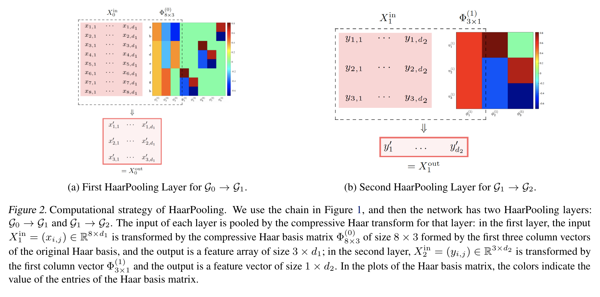
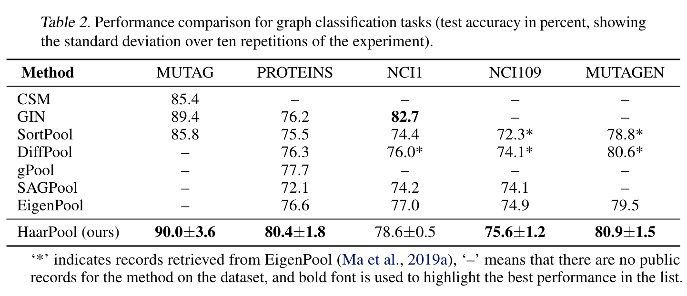

# Haar Graph Pooling
This repository is the official implementation of [Haar Graph Pooling (Wang et al., ICML 2020)](https://arxiv.org/abs/1909.11580). 




## Requirements

To install requirements:

```setup
pip install -r requirements.txt
```

## Training and Evaluation

To train and test the model(s) in the paper, run the following command. We provide the codes for HaarPool on five graph classification benchmarks in Table 1. The dataset will be automatically downloaded and preprocessed before training. All the experiments were performed using [PyTorch Geometric](https://github.com/rusty1s/pytorch_geometric) and run on a server with Intel(R) Core(TM) i9-9820X CPU 3.30GHz, NVIDIA GeForce RTX 2080 Ti.

HaarPool on Graph classification benchmark datasets; $dataname to be replaced by MUTAG, PROTEINS, NCI1, NCI109, Mutagenicity
```
python haarpool_$dataname.py
```
Other hyperparameters: --batch_size, --learning_rate, --weight_decay, --pool_ratio, --nhid, --epochs

## Results

Our model HaarPool achieves the following performance on graph classification benchmark datasets MUTAG, PROTEINS, NCI1, NCI109, Mutagenicity. The table below shows the mean test accuracy with SD for 10 repetitions. Compared to existing methods such as CSM, GIN, SortPool, DiffPool, gPool, SAGPool, EigenPool with the same network architecture, the HaarPool achieves top test accuracy on four of five datasets, and in some cases, improve state of the art by a few percentage points. The results are obtained using the above .py programs. Experiments for HaarPool on Triangles Classification and Quantum Chemistry Regression tasks can be seen in the paper.



## Citation 
If you use our codes and datasets, please cite:
```
@article{wang2020haar,
  title={Haar Graph Pooling},
  author={Wang, Yu Guang and Li, Ming and Ma, Zheng and Mont\'{u}far, Guido and Zhuang, Xiaosheng and Fan, Yanan},
  journal={ICML},
  year={2020}
}
```

## Contributing
Copyright (c) <2020> <NeurIPS>

Permission is hereby granted, free of charge, to any person obtaining a copy
of this software and associated documentation files (the "Software"), to deal
in the Software without restriction, including without limitation the rights
to use, copy, modify, merge, publish, distribute, sublicense, and/or sell
copies of the Software, and to permit persons to whom the Software is
furnished to do so, subject to the following conditions:

The above copyright notice and this permission notice shall be included in all
copies or substantial portions of the Software.

THE SOFTWARE IS PROVIDED "AS IS", WITHOUT WARRANTY OF ANY KIND, EXPRESS OR
IMPLIED, INCLUDING BUT NOT LIMITED TO THE WARRANTIES OF MERCHANTABILITY,
FITNESS FOR A PARTICULAR PURPOSE AND NONINFRINGEMENT. IN NO EVENT SHALL THE
AUTHORS OR COPYRIGHT HOLDERS BE LIABLE FOR ANY CLAIM, DAMAGES OR OTHER
LIABILITY, WHETHER IN AN ACTION OF CONTRACT, TORT OR OTHERWISE, ARISING FROM,
OUT OF OR IN CONNECTION WITH THE SOFTWARE OR THE USE OR OTHER DEALINGS IN THE
SOFTWARE.
